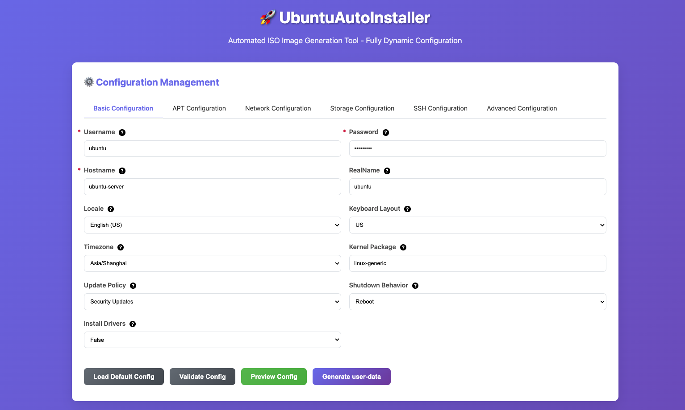

<h1 align="center">AutouISO</h1>

**AutouISO** is a **web-based Ubuntu Autoinstall ISO generator** built with **Go + Gin**.  
It supports **cloud-init** automation, real-time validation, and visual configuration of system parameters.

## Features

###  Configuration Management
- **Interactive Web Builder** — Create autoinstall configs visually
- **YAML Import/Export** — Seamless configuration portability
- **Predefined Templates** — Ready-to-use setups for common scenarios
- **Real-time Validation** — Catch errors before ISO build
- **Preview Mode** — Review generated `user-data` instantly

### ISO Generation
- Support for **local ISOs** or direct download from Ubuntu mirrors
- Auto-fetch latest Ubuntu Server releases (**20.04 / 22.04 / 24.04**)
- **GPG Verification** for enhanced security (optional)
- Integrate **custom packages** into ISO
- **HWE Kernel** support for modern hardware
- Auto-update **MD5 checksums** for integrity

### Web Interface & API
- Full-featured **RESTful API**
- **Live build progress** with detailed logs
- Upload and process custom ISO files
- **Swagger-based API docs**
- Manage **parallel builds**
- Direct ISO download via web interface

### Cloud-Init Integration
- Generate complete **cloud-init configurations**
- Advanced **networking** (static IP, bridges, bonding)
- **User & SSH key management**
- Flexible **storage layouts** and partitioning
- Define extra **packages** to install
- Run custom **post-install scripts**




## Install

### Requirements

- **Go 1.24.5+**
- Linux/macOS/Windows (Ubuntu Linux recommended)
- Tools: `xorriso`, `p7zip/7zip`
- Network access to fetch Ubuntu ISOs

### Run Locally

Start by cloning the repository:
```bash
git clone https://github.com/lefeck/autouiso
cd autouiso
make run
```
You can also build using make build, which will compile in the web assets so that AutouISO can be run from anywhere:

```bash
make build
./autouiso
```
The Makefile provides several targets:
* build: Builds the project and places the binary in the current directory.
* run: Run the project.
* test: Run tests.
* deps: Install project dependencies.
* vet: Run static analysis.
* fmt: Formatting
* package: Archive artifacts (zip for Linux, tar.gz for others)
* clean: Clean up the project.
* help: Display help.
* docker-build: Build the project and place the binary in the current directory.
* docker-run: Run the project.
* docker-push: Push the project to the registry.
* compose-up: Starts the project using docker-compose.
* compose-down: Stops the project using docker-compose.
* compose-logs: View the logs of the project using docker-compose.


### Docker images

Docker images are available on [ACR](https://cr.console.aliyun.com) or [Docker Hub](https://hub.docker.com/).

You can launch a Autouiso container for trying it out with

```
# autouiso ubuntu 22.04
docker run --rm -p 8080:8080 --name autouiso jetfuls/autouiso:1.0-ubuntu22.04
# or
docker run --rm -p 8080:8080 --name autouiso crpi-g7nxbvns4i9rnvaf.cn-hangzhou.personal.cr.aliyuncs.com/jetfuls/autouiso:1.0-ubuntu22.04

# autouiso ubuntu 24.04
docker run --rm -p 8080:8080 --name autouiso jetfuls/autouiso:1.0-ubuntu24.04
# or
docker run --rm -p 8080:8080 --name autouiso crpi-g7nxbvns4i9rnvaf.cn-hangzhou.personal.cr.aliyuncs.com/jetfuls/autouiso:1.0-ubuntu24.04
```

Access:

- Web UI → [http://localhost:8080](http://localhost:8080)
- API Docs → [http://localhost:8080/swagger/index.html](http://localhost:8080/swagger/index.html)


### Building the Docker image 

You can build a docker image locally with the following commands:

```bash
# Build
make docker-build REGISTRY_USER=jetfuls APP_VERSION=1.0 UBUNTU_VERSION=22.04

# Run
make docker-run DOCKER_IMAGE=jetfuls/autouiso:1.0-ubuntu22.04
```
Notes:
- `REGISTRY_USER`: your Docker registry username
- `APP_VERSION`: your app version
- `UBUNTU_VERSION`: your Ubuntu version
- `DOCKER_IMAGE`: your Docker image name


### Docker Compose

If you are using `docker-compose.yml`, you can start the service stack with:

```
# Start (auto-builds the image if not present)
make compose-up # 22.04 
# or
make compose-up COMPOSE_FILE=docker-compose-24.04.yml

# View logs
make compose-logs

# Stop
make compose-down
```

### Health Check

To check the health of your Autouiso instance, use the following command:

```bash
curl -sf http://localhost:8080/health && echo OK || echo FAIL
```


### Supported Platforms

Considering that this project is designed for Ubuntu:

- In a non-Docker environment, it can only run on an Ubuntu host.

- In a Docker environment, it can run on any operating system.

### FAQ

- **Blank UI / 404?** → Check `STATIC_DIR` path
- **Health check fails?** → Inspect logs: `docker logs autouiso`
- **ISO build fails?** → Fix config validation errors, then check network


### Contribution

Contributions via Issues & PRs are welcome


### License

Licensed under the **MIT License** – see [LICENSE](LICENSE).

